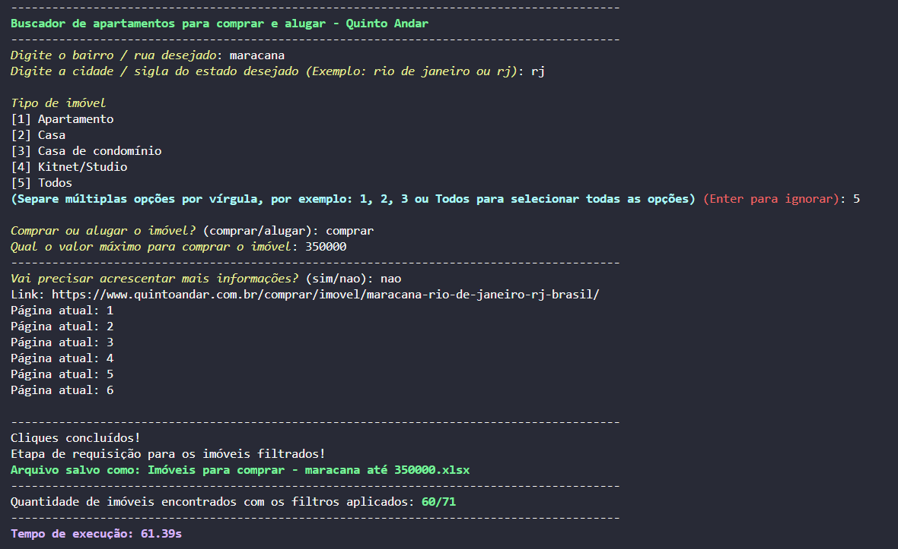
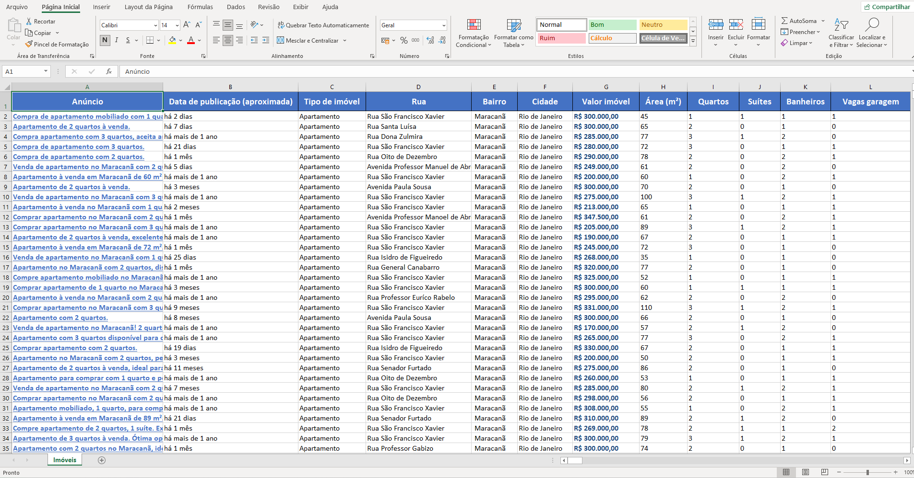
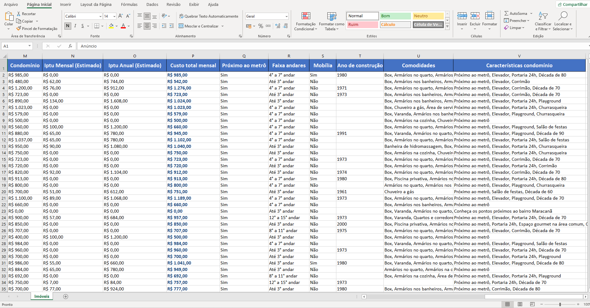
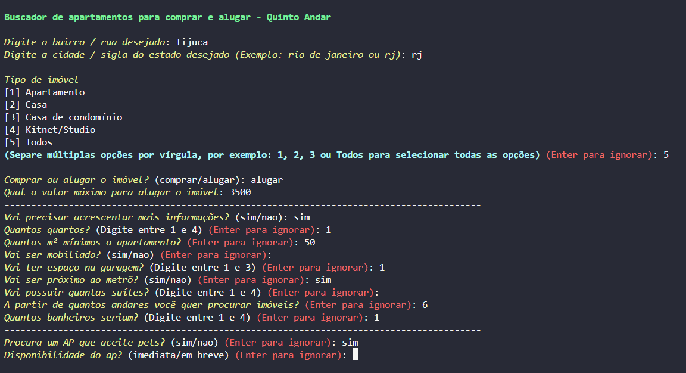
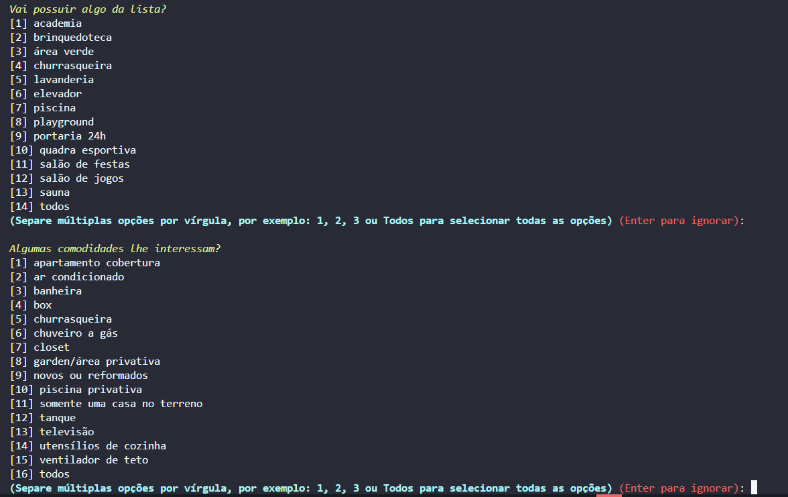
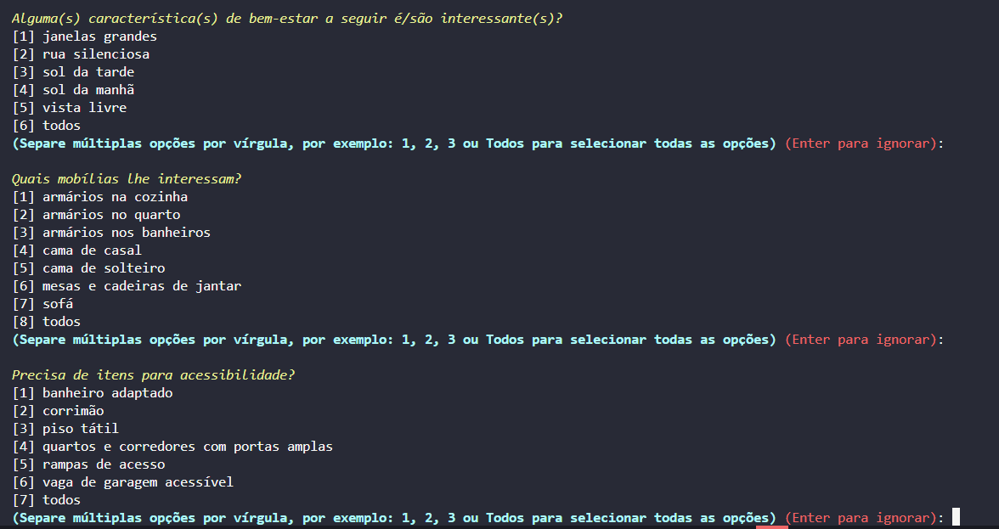
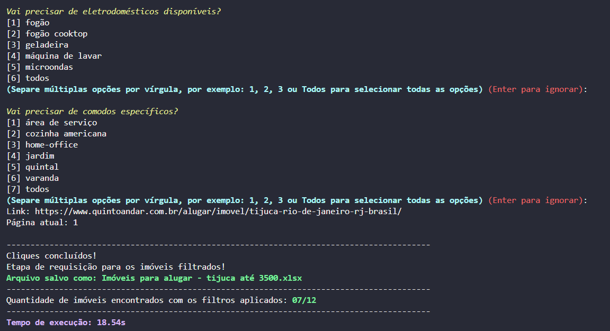
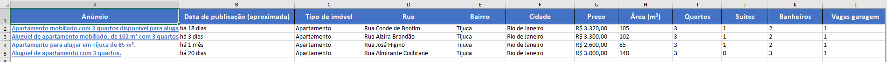
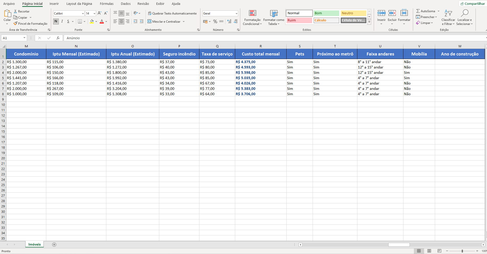
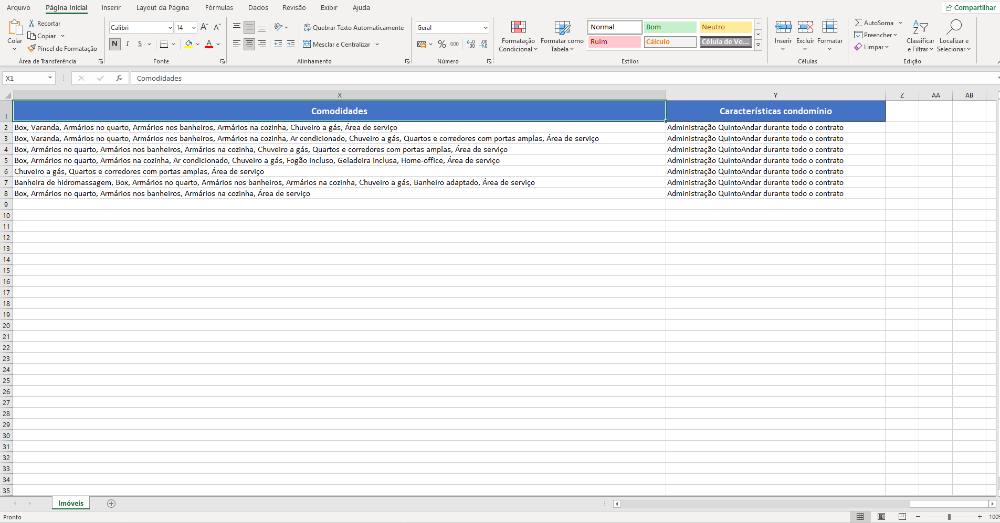

# QuintoAndar Property Scraping


<p> A Python-based automated scraping system for extracting real estate listings from QuintoAndar, applying dynamic multi-parameter filters (such as price range, bedrooms, area, amenities, and location).</p>
<p>Generates structured Excel reports enriched with cleaned, validated, and normalized data for further analysis.</p>


## 📥 Installation
1. Clone the repository and navigate into the directory
   ```bash
   git clone https://github.com/HugoCDM/quintoandar-scraper.git
   cd quintoandar-scraper
   ```
2. Create and activate a virtual environment (optional)
   ```bash
   python -m venv venv 
   .\venv\Scripts\activate 
   ```
3. Install the dependencies -requirements
   ```bash
   pip install -r requirements.txt 
   ```
If you have trouble with .\venv\Scripts\activate, run Windows PowerShell on your search bar as an administrator and write:
```bash
Set-ExecutionPolicy -ExecutionPolicy Unrestricted -Scope CurrentUser # Then type Y and press Enter. Go to step 2
```

## How to Run

After installing the dependencies, just run:

```bash
python main.py
```

## Project Structure
```bash
images/
    ├── excel-1.1.png
    ├── excel-1.png
    ├── excel-2.1.png
    ├── excel-2.png
    ├── filters-1.png
    ├── quinto_andar_site_2.png
    ├── search-2.1.png
    ├── search-2.2.png
    ├── search-2.png
    ├── search-results-1.png
    └── search-results-2.png
src/
    ├── config/
        ├── __init__.py
        ├── colors.py
        └── constants.py
    ├── scraper/
        ├── __init__.py
        └── quinto_andar.py
    └── utils/
        ├── __init__.py
        ├── button_attempts.py
        ├── excel_file.py
        ├── formatting.py
        ├── inputs.py
        ├── requests_extractor.py
        └── selenium_utils.py
.gitignore
main.py
README.md
requirements.txt
```

## 🖱 Usage
### 1. Required inputs
- neighborhood: defines the neighborhood or street where the search will be performed.
- city: city name or state abbreviation (e.g., RJ, Rio de Janeiro).
- choice: defines whether the user is searching for properties to rent or buy.
- property_value: maximum property value to filter results.
- additional: enables the use of extra filters such as number of rooms, parking spots, total area, etc

### 2. Additional inputs
- rooms: number of bedrooms (range: 1–4).
- area: minimum apartment area in square meters.
- furnished: whether the property should be furnished (yes/no).
- garage: number of parking spaces (range: 1–3).
- near_subway: whether the property must be near a subway station (yes/no).
- suites: number of suites (range: 1–4).
- cond_iptu: Maximum combined value of condominium fee + IPTU.
- floors: minimum floor level required.
- bathrooms: number of bathrooms (range: 1–4).
- pets: whether the property must accept pets (yes/no).
- availability: desired property availability (e.g., Imediato, Em).

#### 2.1 Predefined categorized features
- condominium_features: select condominium characteristics from a predefined list.
- amenities_features: choose desired amenities such as pool, gym, playground, etc.
- wellness_features: wellness-related attributes (e.g., sauna, spa).
- furniture_features: specific furniture items of interest.
- accessibility_features: accessibility-related requirements.
- appliances_features: available appliances (e.g., refrigerator, stove).
- rooms_features: specific additional rooms needed (e.g., office, storage).


## ƒ Functions

### quinto_andar > search_listings()
- Main Function. Performs automated scraping of real estate listings on QuintoAndar using Selenium and multiple parameter filters.

### button_attempts > button_next()
- Attempts to click the "Ver mais" button on the QuintoAndar results page.

### formatting > build_link()
- Build a QuintoAndar search URL using the provided parameters.

### formatting > unidecode_features()
- Normalize text by converting it to lowercase, removing accents, and optionally splitting it into a list.

### formatting > required_inputs()
- Mandatory input values that cannot be skipped.

### formatting > numeric_inputs()
- Inputs consisting of numeric values.

### formatting > range_inputs()
- Inputs constrained to a specific numeric range [min-max], e.g., range(1, 4).

### formatting > yes_no_inputs()
- Inputs with selectable [yes/no] choices.

### selenium_utils > configure_driver()
- Configures and returns a Chrome WebDriver instance with predefined settings

### selenium_utils > search_more_filters()
- Performs Selenium click actions for each filter variable in the website menus.

### requests_extractor > property_features()
- Extracts and processes property features from HTML parsed with BeautifulSoup.

### excel_file > create_excel()
- Creates and formats an Excel file containing real estate listings scraped from QuintoAndar.

## 🌅 Image section


### Properties for sale in Maracanã – up to R$ 350,000 
  
  

 ### Excel Report
  
 

 <br><br>

 ### Properties for rent in Tijuca – up to R$ 3,500/month
  
  
  
  

 ### Excel Report
  
 
 


### *Made by [Hugo Mello](https://github.com/HugoCDM)*


